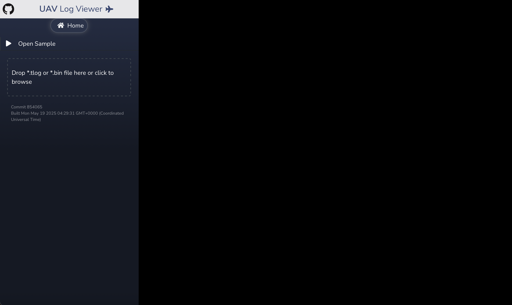
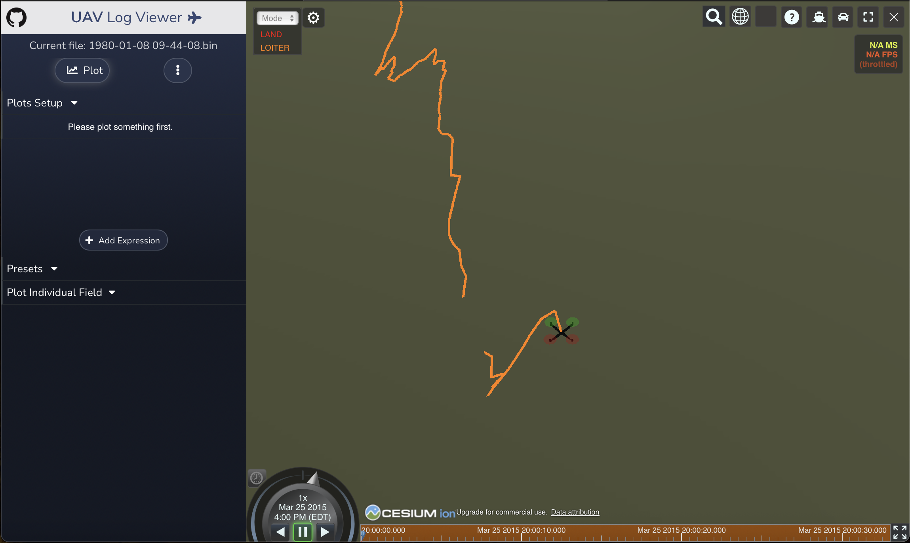

**Note**: The original code is taken from [here](https://github.com/ArduPilot/UAVLogViewer), and I'm implementing/integrating the components below on top of the UI:

- Backend API development
- API Gateway
- Agentic chatbot integration
- File management system
- Authentication and session management
- Rate limiting 

<div>
  <h2 style="text-align: left;">Before</h2>
  <div style="display: flex; justify-content: flex-start; flex-wrap: wrap; gap: 20px; margin-bottom: 40px;">
    
    
    <!-- Added YouTube video -->
    <iframe width="440" height="247" 
            src="https://www.youtube.com/embed/hkE4JivR_9U" 
            frameborder="0" 
            allow="accelerometer; autoplay; clipboard-write; encrypted-media; gyroscope; picture-in-picture" 
            allowfullscreen>
    </iframe>
  </div>

  <h2 style="text-align: left;">After</h2>
  <div style="display: flex; justify-content: flex-start; margin-bottom: 20px;">
    <iframe width="900" height="506" 
            src="https://www.youtube.com/embed/vtJJbjGfosw" 
            frameborder="0" 
            allow="accelerometer; autoplay; clipboard-write; encrypted-media; gyroscope; picture-in-picture" 
            allowfullscreen>
    </iframe>
  </div>
</div>


### Running 

```bash
pip install -r requirements.txt
```

```bash
npm install -g firecrawl-mcp
```

```bash
pip install firecrawl-py==0.0.20
```