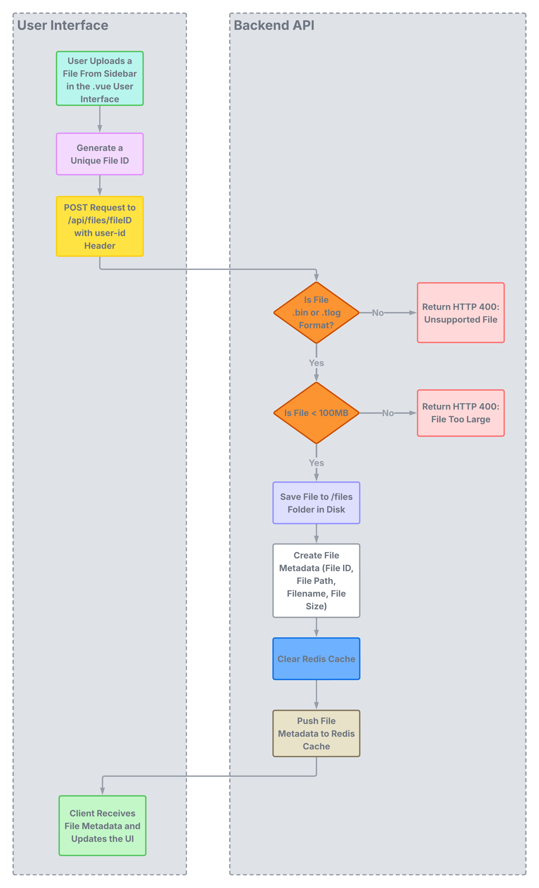
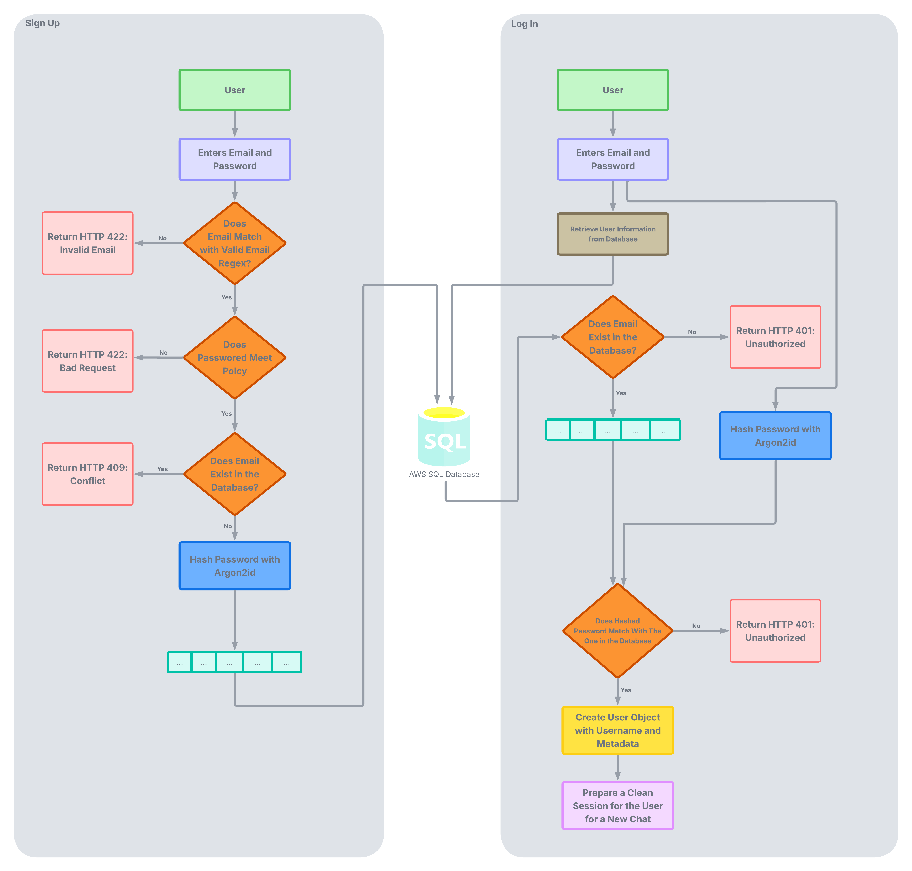
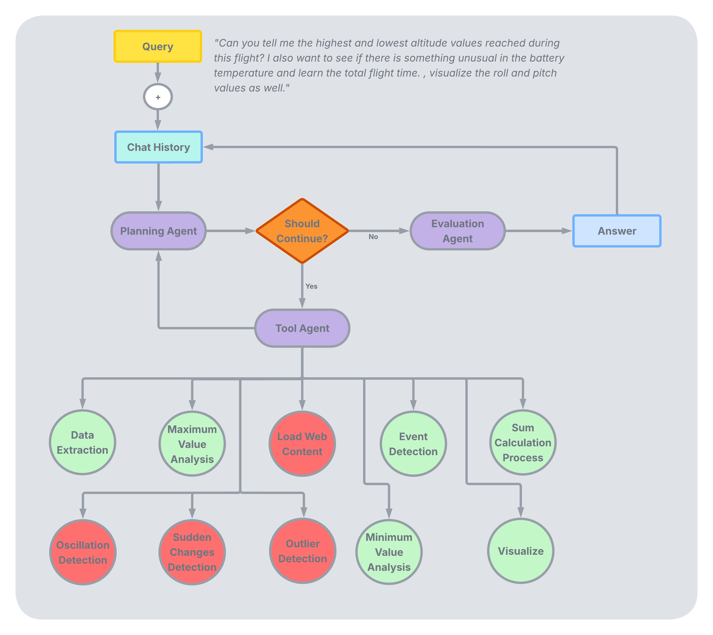

**Note**: The original code used to build the UI is taken from [here](https://github.com/ArduPilot/UAVLogViewer), and I am implementing/integrating the features below on top of the UI:

# Features

- Backend API development <span style="color: #28a745; font-weight: bold;">**(Done)**</span>
- Agentic chatbot development and integration <span style="color: #28a745; font-weight: bold;">**(Done)**</span>
- Session management <span style="color: #28a745; font-weight: bold;">**(Done)**</span>
- Rate limiting <span style="color: #28a745; font-weight: bold;">**(Done)**</span>
- Integration of data analytics tools executable by LLMs with result interpretation <span style="color: #28a745; font-weight: bold;">**(Done)**</span>
- Redis caching for extracted data <span style="color: #28a745; font-weight: bold;">**(Done)**</span>
- Web scraping integration with Firecrawl <span style="color: #28a745; font-weight: bold;">**(Done)**</span>
- Multi-service Docker orchestration <span style="color: #28a745; font-weight: bold;">**(Done)**</span>
- File management system <span style="color: #28a745; font-weight: bold;">**(Done)**</span>
- Authentication <span style="color: #28a745; font-weight: bold;">**(Done)**</span>
- Chat history persistence and storage <span style="color: #dc3545; font-weight: bold;">**(Not Started Yet)**</span>
- Safety validation for LLM-generated data visualization code <span style="color: #dc3545; font-weight: bold;">**(Not Started Yet)**</span>
- MCP server for executing data visualization code <span style="color: #dc3545; font-weight: bold;">**(Not Started Yet)**</span>

# Demo 

<div style="display: flex; justify-content: flex-start; margin-bottom: 20px;">
<iframe width="1000" height="506" src="https://www.youtube.com/embed/0gnxuxyAHpI?si=gSNs7bPwrCCJ1UBS" title="YouTube video player" frameborder="0" allow="accelerometer; autoplay; clipboard-write; encrypted-media; gyroscope; picture-in-picture; web-share" referrerpolicy="strict-origin-when-cross-origin" allowfullscreen style="max-width: 1000px; border-radius: 8px; box-shadow: 0 4px 12px rgba(0,0,0,0.1);"></iframe>
</div>

# Running  

Create a `files` folder inside `api`

```bash
mkdir -p api/files
```

## Configure Environment Variables

Create an `.env` file in the root folder with the following values. The environment variables will be automatically loaded when you run the development server:

```env 
# Cesium 
VUE_APP_CESIUM_TOKEN=<your_cesium_ion_token>   # Get from https://ion.cesium.com/signin
VUE_APP_CESIUM_RESOURCE_ID=3

# MapTiler 
VUE_APP_MAPTILER_KEY=<your_maptiler_key>       # Get from https://docs.maptiler.com/cloud/api/authentication-key/

# OpenAI 
OPENAI_API_KEY=<your_openai_api_key>           # Get from https://platform.openai.com/api-keys

# Firecrawl
FIRECRAWL_API_KEY=<your_firecrawl_api_key>     # Get from https://www.firecrawl.dev

# Chatbot
CHAINLIT_AUTH_SECRET=<your_chainlit_secret>    # Get from https://docs.chainlit.io/authentication/overview

# Set the maximum file size allowed for uploading
MAX_FILE_SIZE_MB=100

# Set how long cached data should stay in Redis (in seconds)
CACHE_TTL_SECONDS=3600

# Set the number of data types that can be extracted from the file in a single request.
MAX_MESSAGE_TYPES=3

# App settings
USER_AGENT=drone-chatbot

# Ports and hosts 
API_HOST=localhost
API_PORT=8001

CHATBOT_HOST=localhost
CHATBOT_PORT=8000

UI_HOST=0.0.0.0
UI_PORT=8080

REDIS_HOST=localhost
REDIS_PORT=6379
REDIS_PASSWORD=<enter_a_password_for_redis>

VUE_APP_API_BASE_URL=http://localhost:8001
VUE_APP_CHATBOT_URL=http://localhost:8000

# Note: 
# If you change the API_HOST, API_PORT, CHATBOT_HOST, or CHATBOT_PORT,
# you should reflect these changes in VUE_APP_API_BASE_URL and VUE_APP_CHATBOT_URL as well:
# VUE_APP_API_BASE_URL=http://API_HOST:API_PORT
# VUE_APP_CHATBOT_URL=http://CHATBOT_HOST:CHATBOT_PORT
```

## Run with Docker Locally

To start building containers and running services, make sure Docker Desktop application is running and run the containers:

```bash
docker-compose up -d
```

Visit `http://localhost:8080/` to interact with the UI and chatbot. The page may take a few moments to load.

Once the page is loaded, enter `admin` in the email field and `password` in the password field to log in to the application. 

**Warning**: Please log in first before uploading a file. 

To stop all services, you can run:

```bash
docker-compose down
```

## Run with Docker in AWS EC2

**1) Create EC2 Instance**
- AMI: Ubuntu 24.04 LTS
- Instance type: m7i-flex.large
- Storage: 20–30 GB
- Number of instances: 1
- Security group rules: Allow ports 22 (SSH from your IP), 8080 (UI), 8000 (Chatbot), 8001 (API) (0.0.0.0/0 for testing)

**2) Connect and Prepare the Machine**
  
```bash  
ssh -i your-key.pem ubuntu@your-public-ip
  
sudo apt update && sudo apt upgrade -y
sudo apt install -y docker.io git
sudo systemctl enable --now docker
sudo usermod -aG docker ubuntu
  
# Install Docker Compose
sudo curl -L "https://github.com/docker/compose/releases/latest/download/docker-compose-$(uname -s)-$(uname -m)" -o /usr/local/bin/docker-compose
sudo chmod +x /usr/local/bin/docker-compose
  
exit
```

```bash
ssh -i your-key.pem ubuntu@your-public-ip
```

**3) Deploy Code**

Clone your repository and configure environment:

```bash  
git clone https://github.com/ozyurtf/agentic-data-assistant.git
cd agentic-data-assistant

# Create and edit .env using the variables listed in the "Configure Environment Variables" section above
touch .env
nano .env   # set OPENAI_API_KEY, VUE_APP_CESIUM_TOKEN, FIRECRAWL_API_KEY, etc.
```

**4) Launch Services**
  
```bash
docker-compose up -d
```

**5) Access**

- UI at `http://your-public-ip:8080`
- Chatbot at `http://your-public-ip:8000`
- API docs at `http://your-public-ip:8001/docs`

- Default login: `admin` / `password`

# Flow Diagrams

<div align="center">
  <table width="100%">
    <tr>
      <td width="50%" align="center" valign="top">
        
        <div><sub>File Upload Flow</sub></div>
      </td>
      <td width="50%" align="center" valign="top">
        
        <div><sub>Data Extraction Tool Flow</sub></div>
      </td>
    </tr>
    <tr>
      <td width="50%" align="center" valign="top">
        
        <div><sub>Authentication Flow</sub></div>
      </td>
      <td width="50%" align="center" valign="top">
        
        <div><sub>Agents Orchestration</sub></div>
      </td>
    </tr>
  </table>
  <br/>
</div>


# Notes

## Configuration Flexibility

The system is fully configurable via the `.env` file:

- **Ports**: Change any service port by modifying `UI_PORT`, `API_PORT`, `CHATBOT_PORT`, or `REDIS_PORT`
- **Hosts**: Configure service hosts using `UI_HOST`, `API_HOST`, `CHATBOT_HOST`, or `REDIS_HOST`

The application will automatically use your configured values throughout the entire stack.

## CORS Configuration
- The API uses CORS and currently allows requests from:
  `- http://localhost:8080` (Vue frontend)
  `- http://localhost:8000` (Chatbot)

If you run the frontend/chatbot on a different host or port (or deploy to a domain),
update `allow_origins` in `api/main.py` so it includes the new origin(s). 