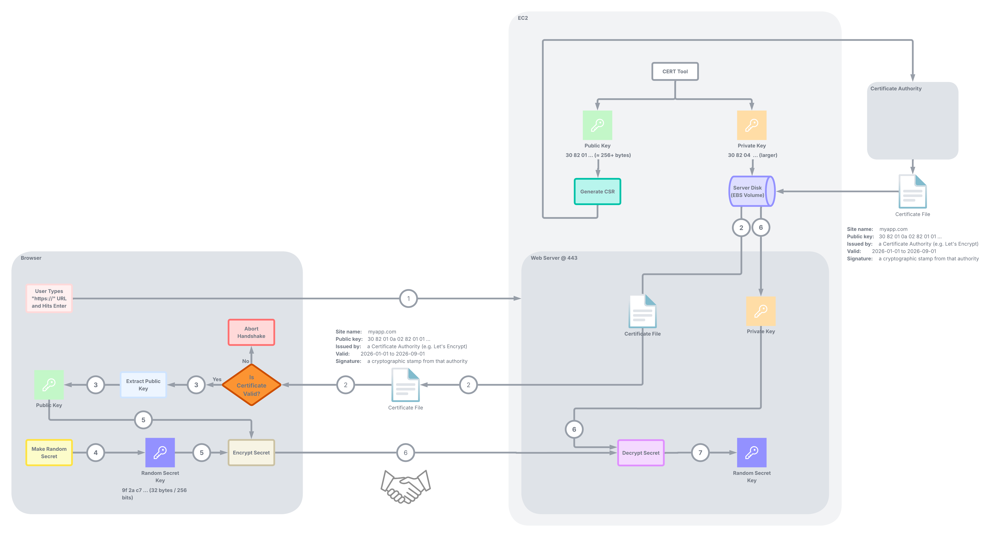
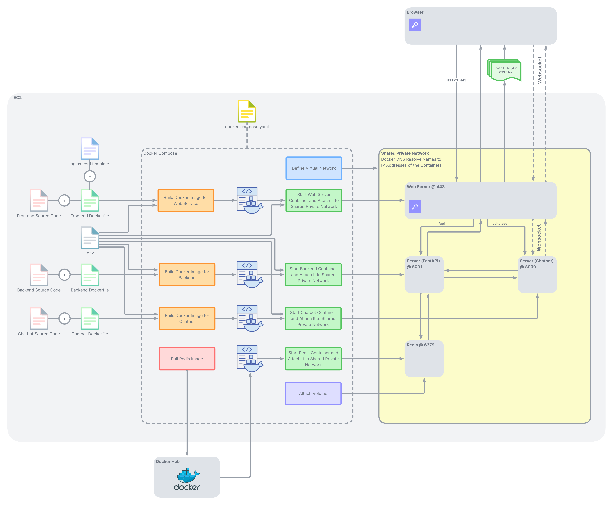

<style>
@import url('https://fonts.googleapis.com/css2?family=Nunito+Sans:ital,wght@0,400;0,600;0,700;1,400&display=swap');

body,
.wrapper,
h1, h2, h3, h4, h5, h6,
p, li, a, td, th, blockquote {
  font-family: 'Avenir Next', 'Avenir', 'Nunito Sans', sans-serif !important;
}

/* Hide the heading anchor-link icons (they render as tofu/hex boxes
   because the forced font has no glyph for the octicon character). */
h1 a.anchor, h2 a.anchor, h3 a.anchor,
h4 a.anchor, h5 a.anchor, h6 a.anchor,
h1 a[aria-hidden], h2 a[aria-hidden], h3 a[aria-hidden],
h4 a[aria-hidden], h5 a[aria-hidden], h6 a[aria-hidden],
.anchor, .octicon, .octicon-link,
.octicon-link::before, .anchor::before, .anchor::after {
  display: none !important;
  content: none !important;
}
</style>

# Demo 

<div style="display: flex; justify-content: flex-start; margin-bottom: 20px;">
<iframe width="1000" height="563" src="https://www.youtube.com/embed/yvr2dXFJIT0?si=10XPvvMSU-CAccHA" title="YouTube video player" frameborder="0" allow="accelerometer; autoplay; clipboard-write; encrypted-media; gyroscope; picture-in-picture; web-share" referrerpolicy="strict-origin-when-cross-origin" allowfullscreen style="max-width: 1000px; border-radius: 8px; box-shadow: 0 4px 12px rgba(0,0,0,0.1);"></iframe>
</div>

**Note**: I saw an open-source project on GitHub (its code can be seen in the `Reference` section at the bottom) a while ago, and I am implementing/integrating the features below on top of it.

My main motivation behind the project is to improve my skills in building a full-stack application that is ready to be used by real people and, more importantly, to enhance my understanding of how various components in a full-stack application work together, rather than just building a simple chatbot.

# Features

### Agentic System
- Multi-agent system <span style="color: #28a745; font-weight: bold;">**(Done)**</span>
- Stateful graph based orchestration with conversational memory <span style="color: #28a745; font-weight: bold;">**(Done)**</span>
- Conditional routing <span style="color: #28a745; font-weight: bold;">**(Done)**</span>
- Multi-step reasoning <span style="color:rgb(241, 140, 16); font-weight: bold;">**(In Progress)**</span>
- Prompt caching <span style="color:rgb(245, 48, 18); font-weight: bold;">**(Not Started)**</span>

### Evaluation
- Manual high-quality and diverse data collection to evaluate the system <span style="color:rgb(241, 140, 16); font-weight: bold;">**(In Progress)**</span>
- Online and offline evaluation system with LangSmith <span style="color:rgb(241, 140, 16); font-weight: bold;">**(In Progress)**</span>
- Tracking the evaluation metrics in a dashboard <span style="color:rgb(241, 140, 16); font-weight: bold;">**(In Progress)**</span>
- Building a separate Docker container for tracking online evaluation metrics <span style="color:rgb(245, 48, 18); font-weight: bold;">**(Not Started)**</span>

### Frontend
- Sign-up and log-in mechanisms integration to the sidebar <span style="color: #28a745; font-weight: bold;">**(Done)**</span>
- Chatbot integration to the sidebar <span style="color: #28a745; font-weight: bold;">**(Done)**</span>
- Photorealistic 3D map <span style="color: #28a745; font-weight: bold;">**(Done)**</span>

### Backend 
- API design and development <span style="color: #28a745; font-weight: bold;">**(Done)**</span>
- Password hashing with Argon2id <span style="color: #28a745; font-weight: bold;">**(Done)**</span>
- JWT authentication <span style="color: #28a745; font-weight: bold;">**(Done)**</span>
- Rate limiting <span style="color: #28a745; font-weight: bold;">**(Done)**</span>
- User session <span style="color: #28a745; font-weight: bold;">**(Done)**</span>
- Caching extracted data and data schema with Redis <span style="color: #28a745; font-weight: bold;">**(Done)**</span>
- Data validation with Pydantic <span style="color: #28a745; font-weight: bold;">**(Done)**</span>
- AWS-hosted PostgreSQL integration to store user information <span style="color:rgb(241, 140, 16); font-weight: bold;">**(In Progress)**</span>
- AWS S3 bucket integration to store the uploaded files <span style="color:rgb(241, 140, 16); font-weight: bold;">**(In Progress)**</span>

### Security
- Encrypted communication <span style="color:rgb(241, 140, 16); font-weight: bold;">**(In Progress)**</span>
- Cookie security: HttpOnly + SameSite <span style="color: #28a745; font-weight: bold;">**(Done)**</span>

### Deployment
- Multi-service Docker orchestration <span style="color: #28a745; font-weight: bold;">**(Done)**</span>
- Reverse proxy integration <span style="color:rgb(241, 140, 16); font-weight: bold;">**(In Progress)**</span>
- Deployment in AWS EC2 <span style="color: #28a745; font-weight: bold;">**(Done)**</span>

# System

### HTTPS: Certificates and the TLS Handshake
<p align="center"></p>

### SPA Load, Cookie-Based Login, Encrypted Communication, WebSocket, and TLS Termination at Reverse Proxy
<p align="center"></p>

### Sign Up, Log In, Argon2id Password Hashing, and JWT Authentication
<p align="center"></p>

### File Upload
<p align="center"></p>

### Agentic Data Extraction
<p align="center"></p>

### Agents
<p align="center"></p>

### Containerization, Orchestration, and Deployment on AWS EC2
<p align="center"></p>

# Evaluation 

## Manual Data Collection
- When preparing the dataset to evaluate the systems, I prepared different groups of datasets to be able to evaluate the system from different/diverse perspectives.
  - Queries that require information available in the uploaded file
    1. Questions that specifically ask which message type and columns to be extracted? (category: `data_extraction`) 
    2. Queries that require extracting and returning specific information from the uploaded file (category: `extractive`) 
    3. Queries that require multi-step reasoning (category: `multi_step_reasoning_single_file`) 
    4. Querues that require multi-step reasoning across separate files (category: `multi_step_reasoning_multiple_files`)
    5. Queries that require relevant information from external web pages (listed below) to be used when generating the answer (category: `external_knowledge_usage`) 
    6. Prompts that request multiple tasks to be completed (category: `multi_task`)
    
  - Queries that require information not available in the uploaded file
    1. Queries that measure the system's awareness of external knowledge related to the uploaded file (category: `external-knowledge-awareness`)
    2. Queries that are not related to this topic at all (category: `general`)
    3. Queries that are technical but cannot be answered using the information available in the uploaded file (category: `not-found`)

The list of web pages that have the technical information that might be beneficial for the agents:
- ArduPilot MAVLink dialect messages: `https://mavlink.io/en/messages/ardupilotmega.html`
- ArduCopter onboard log messages: `https://ardupilot.org/copter/docs/logmessages.html`
- Standard MAVLink common messages: `https://mavlink.io/en/messages/common.html`

## Offline Evaluation
- **Context score** (whether all the required data and information is available in the context)
- **Correctnes score** with LLM as a judge (whether the answer semantically matches with the ground truth)
- **Exact match score** (for questions that require extracting specific data from the uploaded file)
- **Node selection** (whether the right nodes are chosen for execution)
- **Tool selection** (whether the right tools are chosen for execution)
- **C-DNF** ("Correct data not found") score (sometimes the user asks a question, but the required data may not exist in the uploaded file. It is important for the system to detect this correclty, and answer that the required data was not found in the uploaded file instead of making assumptions).
- **Average task completion rate** (out of all the user requests in a prompt, how many are completed successfully?)
- **Conciseness**

## Online Evaluation
- **P50/P90/P99 latency**
- **Total token usage**
- **Total cost**
- **Node failure rate**
- **Tool failure rate**
- **Cache hit rate**
- **Ratio of failed answers**
- **User-reported feedback**

## Evaluation Platform 
To track these metrics, there were many options such as: 

- LangSmith
- OpenAI evaluation platform 
- Anthropic evaluation platform
- Manual evaluation with custom Python code and Weights & Biases

Considering that I had already used LangChain and LangGraph during the process, and that LangSmith already provides many features that make it easy to evaluate the system and build dashboards, I decided to use **LangSmith**.

## Dashboard

`To be announced`

## Deploy in AWS

**1) Create EC2 Instance**

- AMI: Ubuntu 24.04 LTS
- Instance type: m7i-flex.large
- Storage: 20–30 GB
- Number of instances: 1
- Security group rules: Allow ports `22` (SSH from your IP), `80`, and `443`.

**Note**: By default, EC2 blocks all inbound traffic. The security group acts as a firewall for the EC2 instance and determines which sources and ports are allowed to access the machine.

**2) Connect and Prepare the Machine**

Run the command below in your computer’s terminal.

```bash  
ssh -i your-key.pem ubuntu@your-public-ip
```

This connects your terminal to the EC2 instance. Next, run the commands below to install Git, Docker, and Docker Compose on EC2, start Docker, and add the `ubuntu` user to the docker group so you can run Docker without sudo.

```bash
sudo apt update && sudo apt upgrade -y
sudo apt install -y docker.io git
sudo systemctl enable --now docker
sudo usermod -aG docker ubuntu
sudo apt install -y docker-compose-plugin
  
exit
```

**3) Deploy Code**

Reconnect to the EC2 instance from the terminal.

```bash  
ssh -i your-key.pem ubuntu@your-public-ip
```

Clone the project repository from GitHub.

```bash  
git clone https://github.com/ozyurtf/agentic-data-assistant.git
cd agentic-data-assistant
```

Create a `files` folder inside the `api` folder.

```bash
mkdir -p api/files
```

Copy the variables below.

```env 
# Cesium 
VUE_APP_CESIUM_TOKEN=<your_cesium_ion_token>   # Get from https://ion.cesium.com/signin
VUE_APP_CESIUM_RESOURCE_ID=3

# Google Maps Platform
VUE_APP_GOOGLE_MAPS_KEY=<your_google_maps_key>

# MapTiler 
VUE_APP_MAPTILER_KEY=<your_maptiler_key>       

# OpenAI 
LLM_PROVIDER=anthropic
OPENAI_API_KEY=<your_openai_api_key>         
ANTHROPIC_API_KEY=<your_anthropic_api_key>

# Firecrawl
FIRECRAWL_API_KEY=<your_firecrawl_api_key>     # Get from https://www.firecrawl.dev

# Chatbot
CHAINLIT_AUTH_SECRET=<your_chainlit_secret>    # Get from https://docs.chainlit.io/authentication/overview

# Set the maximum file size allowed for uploading
MAX_FILE_SIZE_MB=100

# Set how long cached data should stay in Redis (in seconds)
CACHE_TTL_SECONDS=3600

# Set the number of data types that can be extracted from the file in a single request.
MAX_MESSAGE_TYPES=3

# App settings
USER_AGENT=drone-chatbot

# Ports and hosts 
REDIS_PORT=6379
CHATBOT_PORT=8000
API_PORT=8001

# Redis password
REDIS_PASSWORD=<enter_a_password_for_redis>

# Auth
JWT_SECRET=<a_long_random_string>               # Generate with: python3 -c "import secrets; print(secrets.token_urlsafe(48))"
JWT_TTL_SECONDS=604800                          # JWT validity window, in seconds (default: 7 days)
AUTH_COOKIE_SECURE=true                         # Set to true in production (requires HTTPS)
AUTH_COOKIE_SAMESITE=lax                        # lax (default) for same-origin dev; none + secure=true for cross-site iframes
```

Create an empty `.env` file, set the values of the copied variables inside the `.env` file, and save it.

```bash 
touch .env
nano .env 
```

**4) Register a Domain Name**

Buy a domain (let's call it `agenticdas.com`) from a registrar (e.g., Namecheap, Cloudflare, GoDaddy, or Google Domains).  A `.com` domain costs about $10/year.

**5) Point the Domain at the EC2 Instance** 

In the DNS panel, create two A records for mapping the domain into the IP address of the EC2 instance:
- agenticdas.com: <your-ec2-public-ip>
- www.agenticdas.com: <your-ec2-public-ip>

**6) Verify the Mapping Locally**

Run the command below in your terminal to verify whether the domain points to the EC2 created in the 1st step.

```bash
dig +short agenticdas.com
``` 

**7) Obtain a Certificate from Certificate Authority**

Install the Certbot on the EC2. 

```bash
sudo apt install -y certbot
sudo certbot certonly --standalone -d agenticdas.com -d www.agenticdas.com
```

After this, the certificate (`fullchain.pem`) and the private key (`privkey.pem`) are saved to the EBS volume (`/etc/letsencrypt/live/agenticdas.com/`).

**Note**: The `nginx.conf.template` file references these files:

```
ssl_certificate /etc/letsencrypt/live/agenticdas.com/fullchain.pem;
ssl_certificate_key /etc/letsencrypt/live/agenticdas.com/privkey.pem;
```

**8) Enable Secure Cookies** 

Make sure that `AUTH_COOKIE_SECURE` is defined as `true` in the `.env` file.

**9) Launch Services in EC2**
  
```bash
docker compose up -d --build
```
**10) Access**

- UI at `https://www.agenticdas.com/`
- Sign up: `admin` / `password`
- Log in: `admin` / `password`


# References

- UAV Log Viewer: `https://github.com/ArduPilot/UAVLogViewer`